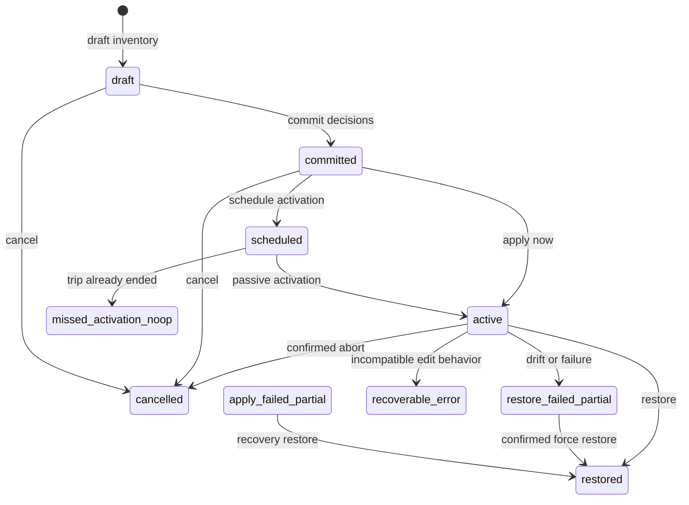

# Architecture

Cron Travel Mode is a deterministic state machine around OpenClaw cron timezone edits. The agent decides intent; the plugin preserves state, validates freshness, mutates cron, and recovers safely.

## Responsibilities

The agent is responsible for:

- converting human travel dates into absolute ISO 8601 instants
- deciding, with the user, which jobs should move or stay
- explaining confirmation prompts and recovery outcomes

The plugin is responsible for:

- compacting cron inventory for classification
- storing the raw inventory locally
- enforcing one active plan
- applying timezone-only cron edits
- recording an apply-time snapshot
- restoring only jobs this plan moved
- detecting drift and requiring force confirmation
- reconciling overdue scheduled actions when any tool is called

## State Phases

Terminal phases such as `restored`, `cancelled`, and `missed_activation_noop` allow a new draft. Scheduled, active, and partial-failure phases block new drafts until the current plan is handled.

## Tool Flow

`generate_travel_cron_plan` has two actions:

- `draft`: fetches cron inventory, stores the raw snapshot, returns compact summaries
- `commit`: stores explicit `move`, `stay`, and `needs_review` decisions

`apply_travel_cron_plan` applies now or marks a committed plan as scheduled for passive activation.

`restore_travel_cron_plan` restores moved jobs from the apply-time snapshot and skips drifted jobs unless force is confirmed.

`abort_or_recover_travel_cron` is the deterministic escape hatch for cancel, abort, partial apply, partial restore, and force recovery.

`travel_cron_status` reports phase, drift, pending confirmations, attention required, and the safest next action.

## Safety Boundaries

Only recurring cron jobs with explicit timezones can be moved. Implicit-timezone jobs are forced to `needs_review`.

The move operation keeps the cron expression and changes only the timezone. The restore operation uses the apply-time snapshot, not the original draft snapshot, so it restores what was actually changed.

Commit rejects changed or missing `move` jobs. Changed `stay` jobs produce a warning but do not block commit because they will never be touched.

The plugin hashes only persisted stable fields: id, name, enabled state, cron schedule, timezone, session, and message. Volatile fields such as next run, last run, history, diagnostics, and previews are excluded.

## Confirmations

Confirmation-required actions return an operation id with a short expiry. The follow-up tool call must include that operation id.

Confirmations are required for:

- late activation during an active trip window
- overdue restore beyond the configured threshold
- early abort of an active trip
- force restore of drifted jobs

## State And Concurrency

State is stored as JSON under the OpenClaw runtime state directory in `cron-travel-mode/current_travel_cron_plan.json`.

Writes are atomic: write a temporary file in the same directory, then rename over the canonical state file.

Mutating operations take an advisory lock file created with exclusive open semantics. Every mutation also checks the expected state revision. Stale locks are cleared automatically.

This lock/revision protocol is the concurrency boundary. Do not rely on in-process mutexes, process ids, `ps`, or platform-specific process discovery.

## Passive Reconciliation

There are no long-lived plugin timers. Any tool call reconciles loaded state:

- scheduled plan after trip end becomes `missed_activation_noop`
- scheduled plan during trip activates if it is inside the grace window
- late activation requires confirmation
- active plan after trip end restores if within threshold
- overdue restore requires confirmation

This makes the plugin robust when OpenClaw is asleep, offline, or idle during scheduled boundaries.
